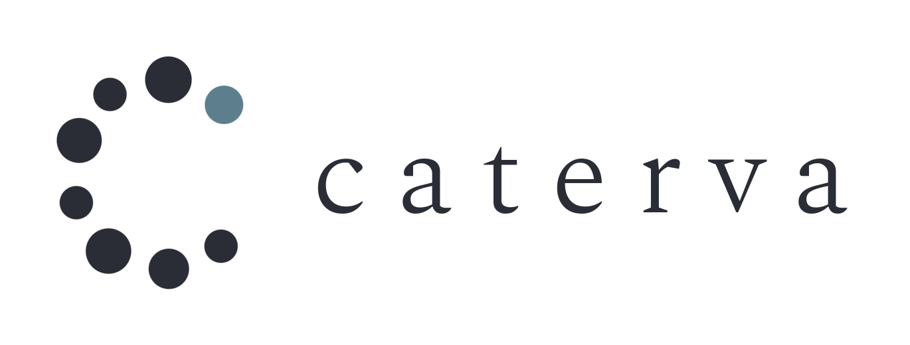

# Caterva

<p align="center">
  <picture>
    <source media="(prefers-color-scheme: dark)" srcset="docs/brand/Logo-dark.png">
    
  </picture>
</p>

<p align="center">
  <strong>Mechanistic models whose every number says where it came from.</strong><br>
  Describe a mechanism in plain words; Caterva builds the model, fills its
  constants from the literature with the reference each came from, and says
  plainly which numbers nobody has measured.
</p>

<p align="center">
  <a href="https://github.com/math12345678/caterva/actions/workflows/tests.yml"></a>
  <a href="https://github.com/math12345678/caterva/releases/latest"></a>
  <a href="LICENSE"></a>
  
</p>

<p align="center">
  <a href="docs/USING_CATERVA.md">User guide</a> ·
  <a href="START_HERE.md">Start here</a> ·
  <a href="CONTRIBUTING.md">Contributing</a> ·
  <a href="https://github.com/math12345678/caterva/releases/latest">Download</a> ·
  <a href="SECURITY.md">Security</a>
</p>

```bash
caterva compose "Michaelis-Menten with a competitive inhibitor" \
    --subject 1.1.1.27 --organism human --substrate pyruvate
# -> Km 0.03 mM (BRENDA ref 286469), Ki 0.00059 mM (BRENDA ref 739793)
#    kcat: never measured in human, so it stays a labelled placeholder and
#    the report names the organisms where it was measured
```


> **Contributing, or just arrived? → [START_HERE.md](START_HERE.md)**
>
> One page: what this is, how to get it running, where things live, and a
> real first task. Everything else is linked from there.

Enzyme kinetics and molecular dynamics for research groups and teaching
labs. Ask a question in plain language; Caterva resolves the real parameters
from the literature, runs the simulation, and shows its work: every number
traceable to a citation that has been independently checked.

What it does today, across five simulation domains and two structure tools:

- **Enzyme kinetics**: plain and competitively inhibited Michaelis-Menten,
  with Km, kcat and Ki resolved from BRENDA at the stated assay conditions,
  and composed mechanisms (`caterva compose`).
- **Stochastic chemical kinetics**: exact Gillespie SSA (first-order decay,
  bimolecular association, and a multi-replicate ensemble).
- **Structures**: `caterva structure` finds the PDB entries for an enzyme,
  separates bound ligands from crystallisation additives, and writes a
  ChimeraX script.
- **Structure audit**: `caterva prepare 1I10` reports what a simulation setup
  would silently get wrong in a PDB entry (mutations whatever they are
  labelled, chain breaks, truncated side chains, the biological assembly),
  each ranked by distance to the enzyme's catalytic residues from M-CSA,
  and says which chain to start from.
- **Trajectory analysis**: `caterva analyze` measures the catalytic
  geometry and active-site flexibility in every replica and reports them
  against the crystal, only once the replicas agree.
- **Molecular dynamics setup**: `caterva md` writes a GROMACS system where
  every setting is measured, chosen or cited, run at the assay conditions
  of a cited constant.

Where the dynamics side is going is in
[docs/design/MD_ROADMAP.md](docs/design/MD_ROADMAP.md). Epidemiology, PCR,
Monte Carlo, population genetics, the Lennard-Jones toy MD and the three
ODE oscillators were archived on 2026-09-27 (see
[archive/legacy_domains/](archive/legacy_domains/README.md)); Caterva
v0.4.0 still runs them.

> **Caterva is not Tellurium.**
>
> [Tellurium](https://tellurium.analogmachine.org/) is an established
> systems-biology environment from the Sauro lab at the University of
> Washington and collaborators including Lucian Smith and Matthias König.
> Caterva is an unaffiliated personal project. It is not a fork of
> Tellurium, not endorsed by its authors, and makes no claim to their work.
>
> Caterva is a *consumer* of that ecosystem: it runs on libRoadRunner and
> generates Antimony, both of which come from that group. It was called Terrium until 2026-09-27, a name too
> close to Tellurium's: it led one researcher to reasonably read a
> cold email as a false claim of credit. It is Caterva now, so the
> two cannot be mistaken for each other.

## Quick start

```bash
git clone https://github.com/math12345678/caterva.git
cd caterva
make setup     # creates .venv, installs everything (2-5 min)
make check     # verifies the stack genuinely works
make test      # runs all 4,115 tests (2,936 engine + 1,179 literature)
```

### Or download the release

Since v0.3.0 (2026-09-21) every tagged version is published on the
repository's Releases page by CI, after it has rebuilt, reinstalled and
run what it attaches. Each release carries one folder per platform that
runs without Python, and a wheel. The literature search stays in the
checkout; the release notes say what else does not ship
([`docs/releases/v0.3.4.md`](docs/releases/v0.3.4.md)). The same access
caveat applies: the repository, and so its Releases page, is private.

```bash
tar xzf caterva-0.3.4-macos-arm64.tar.gz      # or linux-x86_64.tar.gz, windows-x86_64.zip
cd caterva && xattr -dr com.apple.quarantine .   # macOS only, once (unsigned folder)
./caterva compose "a toggle switch between two repressors"
```

```bash
pip install caterva-0.3.4-py3-none-any.whl     # the wheel, from the same page
caterva-compose "a toggle switch between two repressors"
```

The folders are not code-signed; macOS quarantines the folder and Windows
SmartScreen asks once, and `README.txt` inside each folder gives the exact
step for its platform (on Windows, run `.\caterva.exe` from a terminal in
the folder).

**Real constants with real citations** need the checkout, not the folder.
`make cite EC=1.1.1.27 SUBSTRATE=pyruvate ORGANISM="Homo sapiens"` returns
`km = 0.03 mM` from `BRENDA ref 286469`, with the papers that disagree and
the conditions it was measured under; and `compose --subject 1.1.1.27
--organism "Homo sapiens" --substrate pyruvate` builds the mechanism with
those constants already in it, each row naming its reference and any
constant the search could not find still marked a placeholder (ADR 0178).

**New to it? [`docs/USING_CATERVA.md`](docs/USING_CATERVA.md)** is the guide:
what to type first, how to read a report, and a recipe for each question a
lab actually asks (which step matters, what to measure next, does the
conclusion survive not knowing the constants). Running `caterva` with no
arguments prints the same quick start.

### See what it produces, before anything else

```bash
make demo
```

Thirty seconds. No network, no BRENDA account, no Node. It reads a saved
BRENDA page committed under `Tests/fixtures/`, runs the real report builder
— the same one the CLI spawns — and prints the document a student would hand
in: the Km with its reference, the values you chose marked as yours, what
the published measurements disagree about, and a section listing what
Caterva refused to do and why.

Because it uses a saved page it demonstrates the pipeline rather than a live
lookup, and **the document says so itself** rather than leaving you to work
it out. Drop `--fixture` from the command it prints at the end to run the
same thing against BRENDA.

**`make test` takes a few minutes**, and prints nothing per-file while it
runs. That is normal. It is written here because the absence of a figure is
what makes a slow suite look like a broken one.

Measured on GitHub's `ubuntu-latest` runners (CI run 36368330079,
2026-09-28), `-p no:randomly`:

| suite | time |
|---|---|
| `caterva/tests` (engine) | 4.5-10 min |
| `Tests/` (literature) | ~5 min |

Test counts are deliberately absent from that table: they are stated once
above and checked by `check_documented_counts.py`, and a second copy here
would be a number that drifts with nothing watching it.

`make test-sim` and `make test-lit` run one half each if you only changed
one, and `pytest --durations=10` names the slowest tests when you want to
know where the time went.

`make setup` needs an interpreter in the supported window and downloads
about 120 MB of prebuilt wheels for the direct pins alone — libroadrunner is
50 MB of it. Every direct pin in `requirements.txt` publishes a wheel, so
nothing in that set compiles from source on x86_64 Linux, macOS or Windows.
Expect two to five minutes, and expect pip to print nothing at all while it
resolves.

**If anything above fails, run `make doctor`.** It reports every interpreter
it found and their versions, whether `.venv` exists and runs, which of the
seven required packages import and at what version against the pin, whether
`stdpopsim` is available, and whether Node is present for the TypeScript
guards — then lists what to do about each. It prints what it checked, not
just a verdict.

### The population-genetics resolver is opt-in

`stdpopsim` is **not** installed by `make setup`. It is GPL-3.0-or-later and
Caterva is Apache-2.0, so a default install would put copyleft code into the
environment of a project that declares a permissive licence — compatible in
one direction only, and not something a reader should have to derive by
comparing two licence files.

```bash
pip install -r requirements-popgen.txt     # adds GPL-3.0-or-later code
```

Nothing is violated either way: Caterva never bundles stdpopsim, and running
two separately-installed packages together is use rather than distribution.
Splitting it just means you can see what you have. See
[ADR 0061](docs/adr/0061-gpl-out-of-the-default-install.md) and NOTICE.

Without it, `test_popgen_resolver.py` skips its 19 tests and the resolver
returns `found=false` with a log saying stdpopsim is not installed — never a
substituted value. `make check` reports the skip as a warning so the gap is
visible; a silent skip would let the population-genetics literature path go
untested and still read as green.

The one platform where it reliably will not install is Linux on arm64:
`msprime`, stdpopsim's C-extension dependency, publishes wheels for
manylinux x86_64, macOS and Windows only, so pip builds it from source there
and needs `libgsl-dev` plus a compiler.

`make check` is not a version-string check. It builds a real Michaelis-Menten
model, translates it to SBML, integrates it, and compares the result to the
exact closed-form solution. If it passes, the numerics are trustworthy.

### Windows

The Makefile is POSIX shell — the interpreter resolver uses `command -v` and
shell functions, and every recipe calls `.venv/bin/...`, which a Windows
venv spells `.venv\Scripts\`. Use **WSL2** or the Dev Container below; both
are ordinary Linux from that point on, and both are what this project
actually exercises.

Nothing under the Makefile is Windows-specific — the steps are plain pip and
pytest — so the native equivalents are in CONTRIBUTING.md under "Windows".
They have not been run on a Windows machine by anyone here; if they fail,
that is a bug worth reporting rather than something you are doing wrong.

### Sandbox (Docker / Dev Containers)

If you'd rather not touch your local Python at all, there's a container that
gives you the same verified environment:

```bash
docker build -f .devcontainer/Dockerfile -t caterva-sandbox .
docker run -it --rm caterva-sandbox
# you're now in a shell where check_env.py has already passed
```

The `-f` matters. The Dockerfile at the repository root is a different
image: it builds the Node API server that `docker-compose.yml` runs and
contains no Python interpreter. The Python sandbox lives in
`.devcontainer/Dockerfile`.

This is also wired up as a [Dev Container](https://containers.dev/) — open
the repo in VS Code with the Dev Containers extension installed and it'll
offer to build and attach automatically. It adds Node 22 on top of the
Python image, because `scripts/verify_build.py --quick` type-checks
TypeScript and needs `npx`. Run `npm install` once inside it before using
that command; `node_modules` is not baked into the image.

## Using it

Caterva is a command-line tool. The point of it is the provenance: every
number it reports says where it came from, and anything it cannot source it
refuses to invent.

```bash
npx ts-node src/cli/scientificCLI.ts help
```

### Look up a measured parameter

```bash
scientific resolve "lactate dehydrogenase" \
  --substrate pyruvate --organism "Homo sapiens"
```

```
✓ KM = 2.5 mM

  System    lactate dehydrogenase / pyruvate
  Organism  Homo sapiens
  Source    brenda_exact
  Citation  BRENDA ref 740253
```

When the organism you asked for has no measurement, Caterva does **not**
quietly hand you another organism's:

```
✗ No KM measured in Homo sapiens for this system.

  BRENDA holds a KM for Oryctolagus cuniculus and Sus scrofa.
  Kinetic parameters are species-specific, so it was not substituted.
  Re-run with --allow-cross-species to use one, understanding that the
  resulting model is not a model of the organism you asked for.
```

That refusal is deliberate. It follows a recommendation from Lisa Jeske of
the BRENDA curation team: *"The simulation should rather abort or leave the
value empty if there is no exact organism match, instead of providing
incorrect data."* See [ADR 0024](docs/adr/0024-refusing-versus-defaulting-an-unsourced-parameter.md).

Opting in does not disable judgement. Candidates must still share a
taxonomic **class** with the organism you asked about, checked live against
NCBI Taxonomy — so a second mammal is offered and a *Plasmodium falciparum*
value for a mouse is not:

```
✗ Cross-species use was enabled, and no candidate passed the relatedness check.

  Plasmodium falciparum and Mus musculus diverge above the class level —
  their nearest shared ranked ancestor is the domain Eukaryota.

  Enabling cross-species data permits a value from a related organism;
  it does not permit one from any organism.
```

It resolves through BRENDA (exact match, then cross-species) and then
PubMed, and reports **three outcomes with three exit codes**:

| exit | meaning |
|---|---|
| 0 | found — a real measurement with its unit, organism and citation |
| 2 | the literature genuinely has nothing for this system |
| 1 | the lookup could not be performed at all |

Most tools collapse the last two. They are different facts, and a tool that
reports "no result" when it actually could not reach the registry teaches
you to read an absence of evidence as evidence of absence.

`--quantity km|ki|kcat` picks which measured parameter. `--json` for scripting.

Add `--allow-cross-species` to accept a value measured in a different but
sufficiently related organism when yours has none. Off by default, and
candidates must still pass an NCBI Taxonomy relatedness check.

### Run a simulation with everything sourced

```bash
scientific simulate mm --resolve \
  --enzyme "lactate dehydrogenase" --substrate pyruvate \
  --organism "Homo sapiens" --s0 10mM --enzyme-conc 0.001mM
```

```
Parameters and where they came from
  s0    10 mM      user
  e0    0.001 mM   user
  km    0.03 mM    brenda_exact  BRENDA ref 286469
  vmax  0.25 mM/s  brenda_cross_species → kcat x [E]0  BRENDA ref 741355
        ⚠ measured in Oryctolagus cuniculus, not the organism requested

  2 of 4 parameter(s) carry a literature citation.

Result
  initial    10.0000 mM
  final      7.5395 mM
  points     101
```

Anything it cannot source stops the run rather than being defaulted. Vmax is
not a BRENDA table — it is `kcat × [E]₀`, and BRENDA does not report an
enzyme concentration, so `--enzyme-conc` is required to bridge it.

**Write units onto the numbers.** `--km 5.2mM`, `--vmax 12.8uM/min`. A bare
number is accepted, but the assumed unit is reported — a Vmax in mM/s read
as μM/min is wrong by a factor of 60,000.

### Ask whether a shaky number matters

```bash
scientific simulate mm --resolve ... --sensitivity
```

```
Sensitivity  (±10% on each parameter)
  s0      13.2%   user
  vmax     3.3%   brenda_exact → kcat x [E]0
  km       0.1%   brenda_cross_species
```

Sensitivity on its own is ordinary. Paired with provenance it answers the
question you actually have: *my Km is a rabbit value — does that change my
conclusion?* Here it does not (0.1%), while the substrate concentration you
chose moves the answer 13.2%.

The report separates two different problems: a **weakly sourced
measurement** that is load-bearing means *measure it for your own system*;
a **load-bearing choice you made** means *state it precisely in your
methods*.

### Inhibition models

```bash
scientific simulate x --resolve --model noncompetitive \
  --enzyme ldh --substrate pyruvate --organism "Homo sapiens" \
  --s0 10mM --i0 0.1mM --enzyme-conc 0.001mM
```

`--model mm|competitive|noncompetitive|product`. Ki resolves from BRENDA's
Ki table with its own citation. Competitive inhibition uses the engine's
first-class domain; non-competitive and product inhibition are emitted as
SBML and run through the engine's `sbml` escape hatch — the same solver
either way, never a second simulator.

Supplying a Ki and running plain `mm` will prompt you: that combination
silently discards the inhibitor.

### Sweep a parameter

```bash
scientific sweep mm --parameter s0 --range 2:10:2 --km 0.5mM --vmax 0.1mM/s
```

```
      2  1.2393
      6  5.0829
     10  9.0499

  shape  ▁▃▄▆█
  trend  increasing  (slope 1.96e+0)
```

Points that break the pattern are flagged separately — usually where the
model stops behaving the way the rest of the range does.

### Past runs

```bash
scientific history
```

Every `--resolve` run is recorded with its full provenance to
`~/.caterva/history.json`, so a job id printed today still means something
tomorrow.

### Environment

| variable | effect |
|---|---|
| `CATERVA_CONTACT_EMAIL` | identifies you to CrossRef's polite pool (better rate limits) |
| `CATERVA_SKIP_DOI_VERIFICATION=1` | skip registry lookups offline. Results become **unverified**, never verified |
| `CATERVA_ALLOW_UNVERIFIED_CITATIONS=1` | accept unverified citations. Cannot rescue a *rejected* one |
| `CATERVA_HISTORY_FILE` | where run history is kept |
| `CATERVA_PYTHON` | which interpreter runs the engine |

## Requirements

**Python 3.10–3.13.** This is a hard constraint, not a preference.
`libroadrunner` 2.8.0 and `numpy` 2.2.6 publish wheels through cp313 and keep
the cp310 floor (verified against PyPI). The 2.9.x libroadrunner line drops
cp310, so we stay on 2.8.0. See
[ADR 0014](docs/adr/0014-python-version-support.md).

## Do not `pip install tellurium`

The umbrella `tellurium` package pulls in `python-libcombine` and
`python-libnuml`, which exist to handle COMBINE archives and numerical markup.
Caterva uses neither. On any platform without prebuilt wheels for them, the
install dies at the cmake step.

Install the three packages that actually do the work instead — they are already
in `requirements.txt`:

| Package | Role |
|---|---|
| `libroadrunner` | ODE integration |
| `antimony` | human-readable model definition → SBML |
| `python-libsbml` | SBML validation |

## Domains

Five simulation domains, plus the structure and MD setup tools:

**Continuous (antimony → SBML → roadrunner):**
- **Michaelis-Menten**: irreversible single-substrate enzyme kinetics.
  Verified against the implicit closed form `Km·ln(S₀/S) + (S₀−S) = Vmax·t`.
- **Michaelis-Menten with competitive inhibition**: `v = Vmax·S / (Km·(1+I/Ki) + S)`.
  Verified against the apparent-Km closed form `Km_app = Km·(1 + I/Ki)`, and
  against plain Michaelis-Menten exactly at I=0.
- **Composed mechanisms** (`caterva compose`): enzyme steps assembled from
  their own words, with every constant resolved or refused.

**Stochastic (direct Python, no ODE solver):**
- **Gillespie SSA**: exact stochastic simulation (ADR 0009) of a single
  first-order decay A → B. Verified against the closed form
  `E[a(t)] = a₀·e^(−kt)` (the count at time t is exactly Binomial(a₀, e^(−kt)))
  and a hand-verified seeded golden trajectory pinned through the API
  (`test_gillespie_ssa_golden.py`, `gillespieGolden.test.ts`).
- **Gillespie SSA bimolecular**: the same Direct Method for the
  association A + B → C with second-order propensity `k·a·b`, conserved
  `a+c = a₀`, `b+c = b₀`, halting at minor-species exhaustion. Verified
  against the ODE closed form
  `a(t) = (a₀−b₀)/(1 − (b₀/a₀)·e^(−k(a₀−b₀)t))` (equal counts:
  `a(t) = a₀/(1 + k·a₀·t)`) and a hand-verified seeded golden trajectory
  pinned through the API (`test_gillespie_ssa_bimolecular_golden.py`,
  `gillespieBimolecularGolden.test.ts`).
- **Gillespie SSA ensemble** (`simulate_gillespie_ssa_replicates`): runs
  `n_replicates` independent SSA trajectories (first-order or bimolecular)
  and reports the sample mean trajectory on a fixed time grid alongside
  each replicate's final counts, for comparing stochastic spread against
  the deterministic reference. Replicate RNGs are derived deterministically
  from a single master seed (ADR 0005), so a fixed seed reproduces the
  whole ensemble bit-identically.

**Structures and dynamics:**
- **`caterva structure`**: PDB entries grouped by protein (isoforms kept
  apart), every entry cited, ChimeraX script.
- **`caterva md`**: GROMACS setup (AMBER ff99SB-ILDN, TIP3P, PME), each
  mdp setting labelled measured, chosen or cited. Run end to end with
  GROMACS 2021 and in CI.

All stochastic domains share a common RNG convention
(`numpy.random.default_rng(seed)` with `seed: int | None = None`), formalised
in ADR 0005 (`docs/adr/0005-rng-convention.md`) and enforced automatically by
`scripts/check_rng_convention.py`.

## Layout

```
Caterva/
├── caterva/                  simulation engine (ODE + discrete/stochastic)
│   ├── caterva_engine.py     public entry point (88 names)
│   └── tests/                2,936 tests
├── Tests/                      literature layer (BRENDA / KEGG / PubMed)
│   ├── brenda_client.py        BRENDA parser (Km, kcat, Ki tables)
│   ├── fallback_logic.py       kinetic-value resolver orchestrator
│   └── ...                   1,179 tests
├── Science-Agent-Pipeline/     API server, database layer, landing page
│   ├── artifacts/api-server/   Express + TypeScript API
│   ├── lib/db/                 Drizzle ORM schema + migrations
│   └── lib/api-spec/           OpenAPI 3.1 spec
├── docs/                       ADRs, engineering constitution, API docs
│   └── adr/                    204 decision records (and counting)
├── scripts/                    78 guard scripts + build verification
│   ├── verify_build.py         runs all guards + tests in one command
│   ├── check_guard_wiring.py   every guard must run somewhere, unasked
│   └── ...                     see scripts/README.md for the full list
└── Docw/                       original specs (Word documents)
```

## API server documentation

`Science-Agent-Pipeline/artifacts/api-server/` has its own docs, covering the
parts of the stack the ADRs and this README don't (day-to-day usage of the
running server, not the science behind it):

- [`API_USER_GUIDE.md`](Science-Agent-Pipeline/artifacts/api-server/API_USER_GUIDE.md)
  — natural-language query syntax, every domain's parameters and real
  current defaults, response shapes, error codes.
- [`INTEGRATION_EXAMPLES.md`](Science-Agent-Pipeline/artifacts/api-server/INTEGRATION_EXAMPLES.md)
  — working Python/JS client code, including SSE job-progress streaming.
- [`DEPLOYMENT_GUIDE.md`](Science-Agent-Pipeline/artifacts/api-server/DEPLOYMENT_GUIDE.md)
  and [`OPERATIONS_RUNBOOK.md`](Science-Agent-Pipeline/artifacts/api-server/OPERATIONS_RUNBOOK.md)
  — running and operating the server.
- [`SECURITY_HARDENING.md`](Science-Agent-Pipeline/artifacts/api-server/SECURITY_HARDENING.md)
  — current security posture and hardening options.
- [`TESTING_AND_CI_CD.md`](Science-Agent-Pipeline/artifacts/api-server/TESTING_AND_CI_CD.md)
  — the api-server's own vitest suite and the real `.github/workflows/tests.yml`
  pipeline.

These were first drafted ahead of the code they described and, on audit,
contained fabricated infrastructure (Kubernetes manifests, Prometheus/Grafana,
AWS Secrets Manager, invented test counts and coverage percentages) presented
as if already built. They've since been corrected against a live read of the
actual source: implemented behavior is described as implemented, and anything
without corresponding code — mostly in the deployment/ops/security docs — is
marked **"Proposed — not yet implemented"** rather than removed, so the
guidance isn't lost but also isn't mistaken for the current state of the
running server. Same discipline as the ADRs: a claim these docs make about the
API should be checkable against `Science-Agent-Pipeline/artifacts/api-server/src`,
not taken on faith.

## How the tests are built

The suites deliberately avoid checking the solver against itself. Numerical
claims are verified against one of:

- **Exact closed-form solutions** — the implicit MM solution
  `Km·ln(S₀/S) + (S₀−S) = Vmax·t`, the apparent-Km relation under
  competitive inhibition, and the SSA mean `a₀·e^(−kt)`.
- **An independent integrator** — scipy's `solve_ivp`, which shares no code
  with roadrunner.
- **Physical invariants** — mass and population conservation, monotonicity,
  non-negativity — checked across the input space with Hypothesis.

The suite is mutation-tested: deliberate scientific errors are injected into
the engine (breaking the rate law, disabling validation, loosening solver
tolerances) and confirmed caught, one at a time, as each domain is
built. Every mutation claimed in an implementation report is independently
reproduced by a reviewer before being trusted — see
build record STAGE_01_PART_04 (private since 2026-09-27) and `STAGE_02_PART_04.md` for
the worked examples, including two cases where the original claimed blast
radius was wrong and got corrected.

## Two gotchas worth knowing

**`gamma` is reserved.** Antimony treats `gamma` as the built-in gamma
function, so a parameter named `gamma` is a hard parse error. The recovery rate
is emitted as `gamma_rate`; the Python API still takes `gamma`, and generated
models carry a comment explaining the rename.

**Plausibility bounds are shared.** `KM_PLAUSIBLE_MIN_MM` and
`KM_PLAUSIBLE_MAX_MM` must stay identical between `brenda_client.py` and
`caterva_engine.py`. They drifted once (1e3 vs 1e4), which meant a Km of
5000 mM was flagged by the literature layer and then silently accepted as
confirmed by the simulation layer. `caterva/tests/test_brenda_integration.py` now pins
them together.

## Common commands

```bash
make doctor      # diagnose a broken setup; reports everything it checked
make check       # verify the environment actually works (builds + integrates a real model)
make test        # run all 4,115 tests
make test-fast   # skip the slow property/robustness suites
make test-sim    # simulation engine only (2,936 tests)
make test-lit    # literature layer only (1,179 tests)
python3 scripts/verify_build.py --quick  # all 78 guard scripts, incl. TypeScript compile
make clean       # remove caches
```
